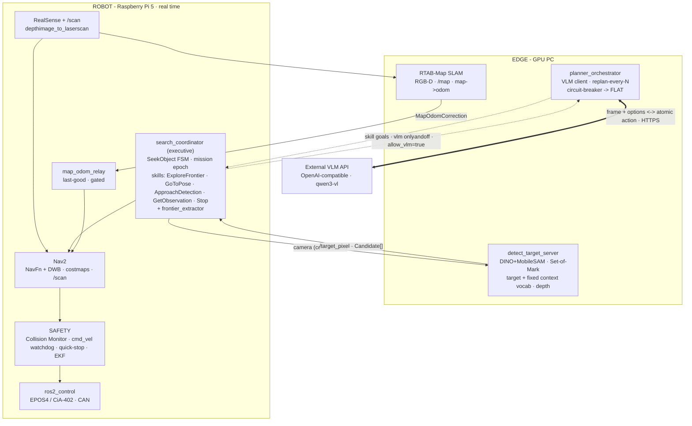

# Solution Architecture Diagram

This is an end-to-end overview of the system: what runs where, how nodes are
connected, and how `flat` differs from `vlm`. Mode details are in
[MODES.md](MODES.md); topic contracts and QoS are in
[DATA_CONTRACTS.md](DATA_CONTRACTS.md) and [../qos_policy.md](../qos_policy.md);
bringup instructions are in [../RUNBOOK.md](../RUNBOOK.md) for hardware and
[../../docker/README.md](../../docker/README.md) for PC Docker.

## Three Layers

- **External VLM API** is a separate OpenAI-compatible service (`qwen3-vl`) that
  we do not host. Credentials come from environment variables (`VLM_BASE_URL`,
  `VLM_API_KEY`, `VLM_MODEL`).
- **EDGE (GPU PC)** handles heavy perception and planning: `detect_target_server`
  (DINO+MobileSAM in a CUDA torch venv, returning `Candidate[]` and Set-of-Mark
  frames), `RTAB-Map` RGB-D SLAM (`/map` and `map->odom` correction), and
  `planner_orchestrator` (VLM HTTP client, only in `vlm` mode).
- **ROBOT (Raspberry Pi 5)** owns the real-time loop: `search_coordinator`
  executive (`SeekObject` FSM + five idempotent skill servers +
  `frontier_extractor`), light Nav2, `ros2_control` hardware interface
  `embodied_robot_system` (EPOS4/CiA-402 over SocketCAN), RealSense, local
  `/scan`, `map_odom_relay`, and the **SAFETY** layer.

## Edge-Pi Link

The cross-link runs over **Wi-Fi through `rmw_zenoh`** with one zenoh router on
the edge host; configs live in [../../deploy/transport/](../../deploy/transport/).
Each exchange point uses a named QoS profile from `fleet_comms/qos.py`
(`control_cmd`, `detection_stream`, `correction_lowrate`, `media_besteffort`,
`liveliness_status`). The full map is documented in
[../qos_policy.md](../qos_policy.md). Raw depth and PointCloud2 do **not** cross
Wi-Fi; only compressed frames and metadata do. Host clocks are disciplined by
`chrony` ([../../deploy/time_sync/](../../deploy/time_sync/)).

**Single camera channel (anti-fan-out).** The camera crosses Wi-Fi exactly once:
the Pi publishes `compressed` JPEG, `compressedDepth`, and `camera_info`; on the
edge, `edge_camera_relay.launch.py` is the **only** Wi-Fi camera subscriber. It
decompresses once and republishes edge-local `/camera_edge/*` streams. SLAM,
detector, and VLM orchestrator subscribe only to `/camera_edge/*`, so additional
edge consumers cost **zero** extra link bandwidth. Direct edge subscriptions to
`/camera/camera/*` are forbidden because each opens its own stream from the Pi,
potentially raw in the worst case.

## Two Modes, One Execution Substrate

The executive and safety layer on the Pi are the **only** real-time execution
loop. Modes differ only in the source of subgoals:

- **`flat`** (solid arrows): the executive is autonomous. The FSM runs
  `SEARCH -> DETECT -> APPROACH` without network or VLM. This is the permanent
  fallback.
- **`vlm`** (dashed arrows): `planner_orchestrator` decomposes the instruction
  into atomic actions and dispatches them to the **same FLAT skills**. Plans are
  adopted only at safe commit points; if the VLM times out or fails,
  `DegradationLatch` returns the system to `flat` seamlessly.

**Invariant:** the VLM is never on the reactive path. The FLAT loop and SAFETY
(Collision Monitor, `cmd_vel` watchdog, CiA-402 quick-stop, EKF) operate
independently from the planner.

## Docker Mapping

[`docker/`](../../docker/README.md) containerizes these layers for PC execution:

| Container (profile) | Diagram layer | Contents |
|---|---|---|
| `sim` (`--profile sim`) | full robot stack in simulation | Gazebo + `flat_sim_bringup`: sim -> RTAB-Map -> Nav2 -> executive in one process, without real CAN/RealSense |
| `detector` (`--profile edge`) | `detect_target_server` (GPU) | DINO+MobileSAM in a torch venv, weights/cache mounted, `--gpus all` |
| `orchestrator` (`--profile edge`) | `planner_orchestrator` | VLM client, credentials from `vlm.env` |

The real **ROBOT (Pi)** layer with CAN/EPOS4/RealSense cannot be reproduced in
Docker on a PC; it requires physical hardware. On a PC, the `sim` container
replaces it.
