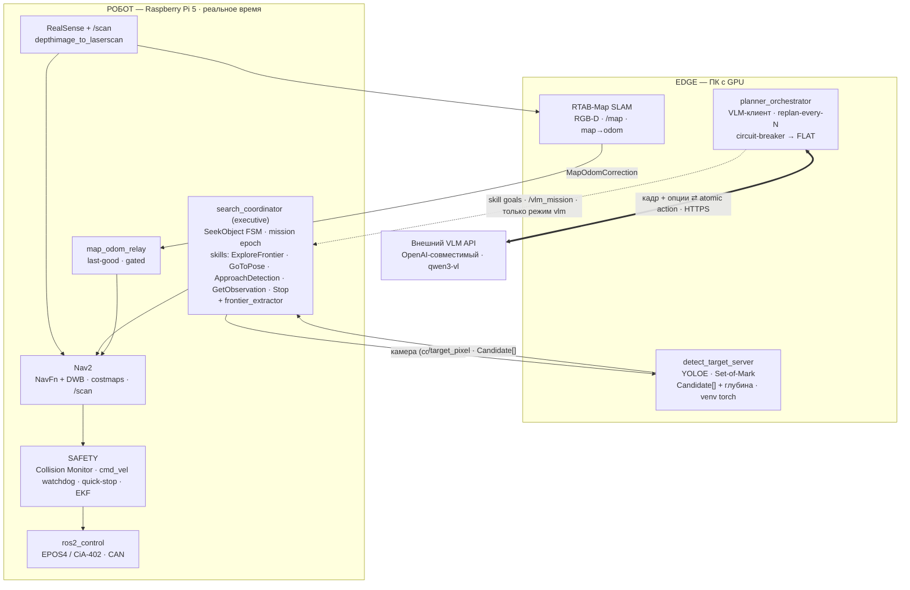

# Схема архитектуры решения

Сквозной обзор системы: что где работает, как узлы связаны и чем режим `flat`
отличается от `vlm`. Детали по режимам — в [MODES.md](MODES.md); контракты топиков
и QoS — в [DATA_CONTRACTS.md](DATA_CONTRACTS.md) и [../qos_policy.md](../qos_policy.md);
как поднимать — в [../RUNBOOK.md](../RUNBOOK.md) (на железе) и
[../../docker/README.md](../../docker/README.md) (на ПК в Docker).

## Три уровня

- **Внешний VLM API** — отдельный OpenAI-совместимый сервис (`qwen3-vl`), мы его не
  хостим. Креды берутся из env (`VLM_BASE_URL` / `VLM_API_KEY` / `VLM_MODEL`).
- **EDGE (ПК с GPU)** — тяжёлое восприятие и планирование: детектор `detect_target_server`
  (YOLOE в venv с torch/CUDA, отдаёт `Candidate[]` + Set-of-Mark кадр), `RTAB-Map`
  RGB-D SLAM (строит `/map` и коррекцию `map→odom`), `planner_orchestrator` (HTTP-клиент
  к VLM, **только в режиме vlm**).
- **РОБОТ (Raspberry Pi 5)** — реактивный контур реального времени: executive
  `search_coordinator` (FSM `SeekObject` + 5 идемпотентных skill-серверов +
  `frontier_extractor`), облегчённый `Nav2`, `ros2_control` с интерфейсом железа
  `embodied_robot_system` (EPOS4/CiA-402 поверх SocketCAN), `RealSense`, локальный
  `/scan`, `map_odom_relay` и слой **SAFETY**.

## Канал Edge ↔ Pi

Кросс-линк идёт по **Wi-Fi через `rmw_zenoh`** (единый zenoh-роутер на edge; конфиги —
[../../deploy/transport/](../../deploy/transport/)). Каждая точка обмена берёт именованный
QoS-профиль из `fleet_comms/qos.py` (`control_cmd`, `detection_stream`,
`correction_lowrate`, `media_besteffort`, `liveliness_status`); полная карта —
в [../qos_policy.md](../qos_policy.md). По Wi-Fi **не** ходят сырые depth/PointCloud2 —
только сжатые кадры и метаданные. Время хостов дисциплинируется `chrony`
([../../deploy/time_sync/](../../deploy/time_sync/)).

## Два режима — один исполнительный субстрат

Исполнитель и слой безопасности на Pi — **единственный** контур реального времени;
режимы отличаются лишь источником подцелей:

- **`flat`** (сплошные стрелки) — executive автономен: цикл `SEARCH → DETECT → APPROACH`
  ведёт сам FSM, без сети и VLM. Это **постоянный fallback**.
- **`vlm`** (пунктир) — `planner_orchestrator` декомпозирует инструкцию в
  последовательность атомарных действий и диспетчеризует их **тем же FLAT-skill'ам**.
  План принимается только в безопасных **commit point**; при сбое/таймауте VLM
  `DegradationLatch` бесшовно возвращает систему к `flat`.

**Инвариант:** VLM никогда не находится на реактивном пути. FLAT-цикл и SAFETY
(Collision Monitor, watchdog `cmd_vel`, quick-stop CiA-402, EKF) работают независимо
от планировщика.

## Отображение на Docker (поднятие на ПК)

[`docker/`](../../docker/README.md) контейнеризует ровно эти уровни для запуска на ПК:

| Контейнер (профиль) | Уровень схемы | Что внутри |
|---|---|---|
| `sim` (`--profile sim`) | весь стек робота в симуляции | Gazebo + `flat_sim_bringup`: sim → RTAB-Map → Nav2 → executive (один процесс, без реального CAN/RealSense) |
| `detector` (`--profile edge`) | `detect_target_server` (GPU) | YOLOE в venv torch; веса монтируются томом; `--gpus all` |
| `orchestrator` (`--profile edge`) | `planner_orchestrator` | VLM-клиент; креды из `vlm.env` |

Реальный уровень **РОБОТ (Pi)** с CAN/EPOS4/RealSense в Docker на ПК не
воспроизводится (нужно физическое железо) — на ПК его заменяет контейнер `sim`.
